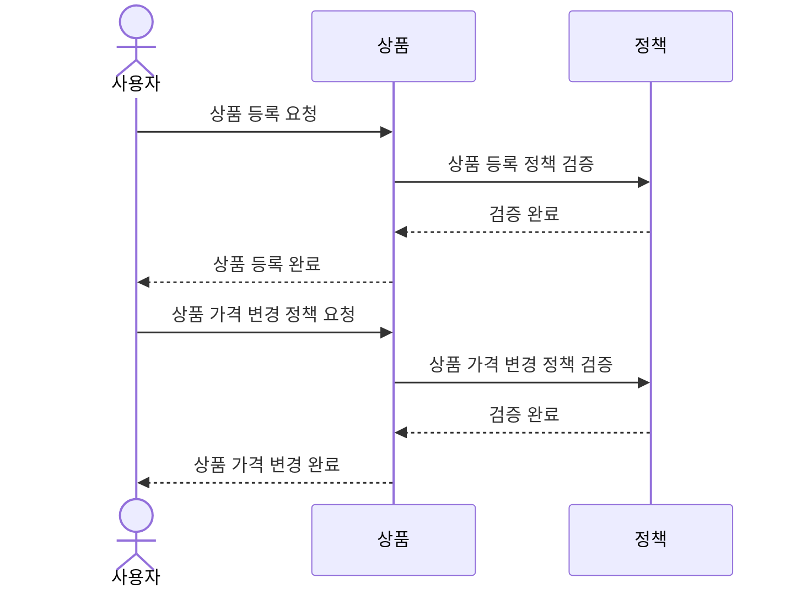

# 키친포스

## 퀵 스타트

```sh
cd docker
docker compose -p kitchenpos up -d
```

## 요구 사항

### 상품

- 상품을 등록할 수 있다.
- 상품의 가격이 올바르지 않으면 등록할 수 없다.
    - 상품의 가격은 0원 이상이어야 한다.
- 상품의 이름이 올바르지 않으면 등록할 수 없다.
    - 상품의 이름에는 비속어가 포함될 수 없다.
- 상품의 가격을 변경할 수 있다.
- 상품의 가격이 올바르지 않으면 변경할 수 없다.
    - 상품의 가격은 0원 이상이어야 한다.
- 상품의 가격이 변경될 때 메뉴의 가격이 메뉴에 속한 상품 금액의 합보다 크면 메뉴가 숨겨진다.
- 상품의 목록을 조회할 수 있다.

### 메뉴 그룹

- 메뉴 그룹을 등록할 수 있다.
- 메뉴 그룹의 이름이 올바르지 않으면 등록할 수 없다.
    - 메뉴 그룹의 이름은 비워 둘 수 없다.
- 메뉴 그룹의 목록을 조회할 수 있다.

### 메뉴

- 1 개 이상의 등록된 상품으로 메뉴를 등록할 수 있다.
- 상품이 없으면 등록할 수 없다.
- 메뉴에 속한 상품의 수량은 0 이상이어야 한다.
- 메뉴의 가격이 올바르지 않으면 등록할 수 없다.
    - 메뉴의 가격은 0원 이상이어야 한다.
- 메뉴에 속한 상품 금액의 합은 메뉴의 가격보다 크거나 같아야 한다.
- 메뉴는 특정 메뉴 그룹에 속해야 한다.
- 메뉴의 이름이 올바르지 않으면 등록할 수 없다.
    - 메뉴의 이름에는 비속어가 포함될 수 없다.
- 메뉴의 가격을 변경할 수 있다.
- 메뉴의 가격이 올바르지 않으면 변경할 수 없다.
    - 메뉴의 가격은 0원 이상이어야 한다.
- 메뉴에 속한 상품 금액의 합은 메뉴의 가격보다 크거나 같아야 한다.
- 메뉴를 노출할 수 있다.
- 메뉴의 가격이 메뉴에 속한 상품 금액의 합보다 높을 경우 메뉴를 노출할 수 없다.
- 메뉴를 숨길 수 있다.
- 메뉴의 목록을 조회할 수 있다.

### 주문 테이블

- 주문 테이블을 등록할 수 있다.
- 주문 테이블의 이름이 올바르지 않으면 등록할 수 없다.
    - 주문 테이블의 이름은 비워 둘 수 없다.
- 빈 테이블을 해지할 수 있다.
- 빈 테이블로 설정할 수 있다.
- 완료되지 않은 주문이 있는 주문 테이블은 빈 테이블로 설정할 수 없다.
- 방문한 손님 수를 변경할 수 있다.
- 방문한 손님 수가 올바르지 않으면 변경할 수 없다.
    - 방문한 손님 수는 0 이상이어야 한다.
- 빈 테이블은 방문한 손님 수를 변경할 수 없다.
- 주문 테이블의 목록을 조회할 수 있다.

### 주문

- 1개 이상의 등록된 메뉴로 배달 주문을 등록할 수 있다.
- 1개 이상의 등록된 메뉴로 포장 주문을 등록할 수 있다.
- 1개 이상의 등록된 메뉴로 매장 주문을 등록할 수 있다.
- 주문 유형이 올바르지 않으면 등록할 수 없다.
- 메뉴가 없으면 등록할 수 없다.
- 매장 주문은 주문 항목의 수량이 0 미만일 수 있다.
- 매장 주문을 제외한 주문의 경우 주문 항목의 수량은 0 이상이어야 한다.
- 배달 주소가 올바르지 않으면 배달 주문을 등록할 수 없다.
    - 배달 주소는 비워 둘 수 없다.
- 빈 테이블에는 매장 주문을 등록할 수 없다.
- 숨겨진 메뉴는 주문할 수 없다.
- 주문한 메뉴의 가격은 실제 메뉴 가격과 일치해야 한다.
- 주문을 접수한다.
- 접수 대기 중인 주문만 접수할 수 있다.
- 배달 주문을 접수되면 배달 대행사를 호출한다.
- 주문을 서빙한다.
- 접수된 주문만 서빙할 수 있다.
- 주문을 배달한다.
- 배달 주문만 배달할 수 있다.
- 서빙된 주문만 배달할 수 있다.
- 주문을 배달 완료한다.
- 배달 중인 주문만 배달 완료할 수 있다.
- 주문을 완료한다.
- 배달 주문의 경우 배달 완료된 주문만 완료할 수 있다.
- 포장 및 매장 주문의 경우 서빙된 주문만 완료할 수 있다.
- 주문 테이블의 모든 매장 주문이 완료되면 빈 테이블로 설정한다.
- 완료되지 않은 매장 주문이 있는 주문 테이블은 빈 테이블로 설정하지 않는다.
- 주문 목록을 조회할 수 있다.

## 용어 사전

### 상품

| 한글명   | 영문명            | 설명                                                     |
|-------|----------------|--------------------------------------------------------|
| 상품    | Product        | 키친포스에서 판매될 수 있는 상품 이름, 상품 가격을 속성으로 가지는 품목              |
| 상품 이름 | Product Name   | 상품의 이름                                                 |
| 상품 가격 | Product Price  | 상품의 가격                                                 |
| 상품 등록 | Create Product | 비속어가 포함되지 않은 상품 이름과 0원 이상의 상품 가격을 가진 상품을 키친포스에 등록하는 행위 |
| 비속어   | Profanity      | 상풍 이름에 포함할 수 없는 욕설 또는 비속어                              |
| 상품 목록 | Product List   | 0개 이상의 상품을 모은 목록                                       |


### 메뉴 그룹

| 한글명       | 영문명                | 설명                                                          |
|-----------|--------------------|-------------------------------------------------------------|
| 메뉴 그룹     | Menu Group         | 0개 이상의 메뉴가 모여있는 집합                                          |
| 메뉴 그룹 이름  | Menu Group Name    | 메뉴 그룹이 가지는 이름. 메뉴 그룹의 이름을 입력해야 만 메뉴 그룹을 등록할 수 있음.           |
| 메뉴 그룹 등록  | Create Menu Group  | 메뉴 그룹을 키친포스에 등록하는 행위. 메뉴를 등록하려면 해당 메뉴가 속할 메뉴 그룹을 우선 등록해야 함. |
| 메뉴 그룹 목록  | Menu Group List    | 0개 이상의 메뉴 그룹을 모은 목록                                         |


### 메뉴

| 한글명      | 영문명                | 설명                                                                                |
|----------|--------------------|-----------------------------------------------------------------------------------|
| 메뉴       | Menu               | 한 개 이상의 메뉴 상품으로 이루어진 상품의 집합                                                       |
| 메뉴 이름    | Menu Name          | 메뉴의 이름. 비속어를 포함할 수 없음.                                                            |
| 메뉴 가격    | Menu Price         | 메뉴의 가격. 메뉴의 가격은 0원 이상이어야 하고 해당 메뉴에 속한 메뉴 상품 금액의 합보다 클 수 없음.                       |
| 메뉴 상품    | Menu Product       | 등록된 상품들 중 특정 메뉴에 속한 상품                                                            |
| 메뉴 등록    | Create Menu        | 메뉴 이름, 메뉴 가격, 한 개 이상의 등록된 상품으로 메뉴 상품을 구성하여 메뉴를 등록하는 행위                            |
| 비속어      | Profanity          | 메뉴 이름에 포함할 수 없는 욕설 또는 비속어                                                         |
| 메뉴 노출    | Display Menu       | 메뉴를 손님에게 노출하는 행위. 손님은 노출된 메뉴만 주문할 수 있음.                                           |
| 메뉴 숨김    | Hide Menu          | 메뉴를 고객에게 노출하지 않고 숨기는 행위. 숨겨진 메뉴는 고객이 주문할 수 없음.                                    |
| 메뉴 가격 변경 | Change Menu Price  | 메뉴 가격을 변경하는 행위. 메뉴 가격 변경 시 메뉴 가격은 메뉴는 0원 이상이어야 하고 해당 메뉴에 속한 메뉴 상품 금액의 합보다 클 수 없음. |
| 메뉴 목록    | Menu List          | 0개 이상의 메뉴를 모은 목록                                                                  |


### 주문 테이블

| 한글명        | 영문명                      | 설명                                          |
|------------|--------------------------|---------------------------------------------|
| 주문 테이블     | Order Table              | 매장 내에서 손님이 이용할 수 있는 테이블.                    |
| 주문 테이블 이름  | Order Table Name         | 주문 테이블의 이름. 주문 테이블 이름은 비워둘 수 없음.            |
| 손님 수       | Number Of Guests         | 매장의 주문 테이블을 사용하는 손님의 수                      |
| 사용 여부      | Occupied                 | 주문 테이블을 손님이 사용하고 있는 지 여부.                   |
| 주문 테이블 등록  | Order Table Registration | 주문 테이블을 등록하는 행위                             |
| 사용 중인 테이블  | Occupied Table           | 손님이 앉아서 사용 중인 테이블                           |
| 빈 테이블      | Unoccupied Table         | 손님이 앉지 않아서 사용 가능한 테이블                       |
| 주문 테이블 사용  | Sit Order Table          | 손님이 주문 테이블에 앉아서 해당 주문 테이블을 사용 중인 상태로 만드는 행위 |
| 주문 테이블 비움  | Clear Order Table        | 사용 중이었던 주문 테이블을 빈 테이블로 만드는 행위               |
| 방문 손님 수 변경 | Change Number Of Guests  | 주문 테이블을 사용하는 손님 수를 변경하는 행위                  |
| 주문 테이블 목록  | Order Table List         | 0개 이상의 주문 테이블을 모은 목록                        |


### 주문

### 주문 공통
| 한글명   | 영문명             | 설명                                                                                          |
|-------|-----------------|---------------------------------------------------------------------------------------------|
| 손님    | Customer        | 음식점에서 음식을 주문하는 고객                                                                           |
| 매장    | Restaurant      | 키친포스를 사용하여 손님에게 음식을 판매하는 식당                                                                 |
| 주문    | Order           | 손님이 매장의 메뉴를 구매한 구매 정보                                                                       |
| 주문 수량 | Order Quantity  | 손님이 구매한 주문 항목의 개수                                                                           |
| 주문 일시 | Order Date Time | 손님이 주문을 등록한 날짜와 시각                                                                          |
| 주문 등록 | Create Order    | 손님이 매장에 있는 메뉴를 구매하는 행위                                                                      |
| 주문 상태 | Order Status    | 주문이 접수 되기 전부터 완료될 때까지의 상태. 주문 상태에는 `접수 대기 중`, `접수 완료`, `서빙 완료`, `배달 중`, `배달 완료`, `완료` 가 있음. |
| 주문 유형 | Order Type      | 손님이 주문할 수 있는 주문의 방식. 주문 유형에는 `배달 주문`, `포장 주문`, `매장 내 주문`이 있음.                               |

### 배달 주문

| 한글명     | 영문명               | 설명                                                                                          |
|---------|-------------------|---------------------------------------------------------------------------------------------|
| 배달 주문   | Delivery Order    | 손님이 주문을 하면 배달 대행사를 통해 특정 장소로 배달되는 주문                                                        |
| 배달 주소   | Delivery Address  | 손님의 음식이 배달될 주소. `배달 주문` 시 비어 있으면 안됨.                                                        |
| 배달 대행사  | Delivery Agency   | 배달을 전문으로 하는 외부 대행사. 매장이 배달 대행사에게 조리된 배달 요청을 하면 배달 주소로 음식을 배달 해 줌.                           |
| 주문 상태   | Order Status      | 주문 접수 대기 부터 완료될 때까지 상태. 배달 주문의 상태에는 `접수 대기`, `접수 완료`, `서빙 완료`, `배달 시작`, `배달 완료`, `완료` 가 있음. |
| 접수 대기 중 | Waiting           | 손님이 `배달 주문`을 했으나 매장이 `배달 주문`을 아직 접수하지 않은 상태                                                 |
| 접수 완료   | Accepted          | 매장이 `배달 주문`을 접수하고 음식을 조리 중인 상태                                                              |
| 서빙 완료   | Served            | 매장이 배달 대행사에게 배달 될 음식을 제공한 상태                                                                |
| 배달 중    | Delivering        | 배달 대행사가 손님에게 음식을 배달하고 있는 상태                                                                 |
| 배달 완료   | Delivered         | 배달 대행사가 손님에게 음식 배달을 완료한 상태                                                                  |
| 완료      | Completed         | 배달 주문의 전 과정이 완료된 상태                                                                         |
| 주문 등록   | Create Order      | 손님이 매장의 메뉴를 `배달 주문` 유형으로 구매하는 행위. 주문 상태는 `접수 대기 중` 상태로 변경됨.                                 |
| 주문 접수   | Accept Order      | 매장이 손님의 주문을 접수하고 음식을 조리하기 시작하는 행위. 주문 상태는 `접수 완료` 상태로 변경됨.                                  |
| 배달 요청   | Request Delivery  | 손님에게 배달을 하기 위해 매장이 외부 배달 대행사에게 배달을 요청하는 행위.                                                 |
| 주문 서빙   | Serve Order       | 매장이 조리 완료된 음식 배달을 위해 배달 대행사에게 넘겨주는 행위. 주문 상태는 `서빙 완료` 상태로 변경됨.                              |
| 배달 시작   | Start Delivery    | 배달 대행사가 조리 완료된 음식을 배달 시작하도록 처리해 주는 행위. 주문 상태는 `배달 시작` 상태로 변경됨.                              |
| 배달 완료   | Complete Delivery | 배달 대행사가 배달 주소로 조리된 음식을 배달을 완료하는 행위. 주문 상태는 `배달 완료` 상태로 변경됨.                                 |
| 주문 완료   | Complete Order    | `배달 주문`의 모든 과정을 완료 처리 해 주는 행위. 주문 상태는 `완료` 로 변경됨.                                           |

### 포장 주문

| 한글명      | 영문명            | 설명                                                                                   |
|----------|----------------|--------------------------------------------------------------------------------------|
| 포장 주문    | TakeOut Order  | 손님이 주문을 하고 음식이 조리되면 직접 매장에서 음식을 찾아가는 주문                                              |
| 주문 상태    | Order Status   | `접수 대기 중`부터 `완료`될 때까지의 주문의 상태. `포장 주문`의 상태에는 `접수 대기 중`, `접수 완료`, `서빙 완료`, `완료` 가 있음. |
| 접수 대기 중  | Waiting        | 손님이 `포장 주문`을 했으나 매장이 아직 주문을 접수하지 않은 상태                                               |
| 접수 완료    | Accepted       | 매장이 `포장 주문`을 접수하고 음식을 조리 중인 상태                                                       |
| 서빙 완료    | Served         | 매장이 손님에게 포장된 음식을 제공한 상태                                                              |
| 완료       | Completed      | 손님이 주문한 음식을 매장으로부터 포장 된 상태로 전달 받아 `포장 주문`의 전 과정이 완료된 상태                              |
| 주문 등록    | Create Order   | 손님이 매장의 메뉴를 `포장 주문` 유형으로 구매하는 행위. 주문 상태는 `접수 대기 중` 상태로 변경됨.                          |
| 주문 접수    | Accept Order   | 매장이 손님의 주문을 접수하고 음식을 조리하기 시작하는 행위. 주문 상태는 `접수 완료` 상태로 변경됨.                           |
| 주문 서빙    | Serve Order    | 매장이 조리 완료된 음식을 포장하여 손님에게 제공하는 행위. 주문 상태는 `서빙 완료` 상태로 변경됨.                            |
| 주문 완료    | Complete Order | `포장 주문` 의 모든 과정을 완료 처리 해 주는 행위. 주문 상태는 `완료` 로 변경됨.                                   |

### 매장 내 주문

| 한글명      | 영문명            | 설명                                                                                      |
|----------|----------------|-----------------------------------------------------------------------------------------|
| 매장 내 주문  | Eat-In Order   | 손님이 매장 내에서 직접 식사를 하는 주문                                                                 |
| 주문 상태    | Order Status   | `접수 대기 중`부터 `완료`될 때까지의 주문의 상태. `매장 내 주문` 의 상태에는 `접수 대기 중`, `접수 완료`, `서빙 완료`, `완료` 가 있음. |
| 접수 대기 중  | Waiting        | 손님이 `매장 내 주문`을 했으나 매장이 아직 접수하지 않은 상태                                                    |
| 접수 완료    | Accepted       | 매장이 `매장 내 주문`을 접수하고 음식을 조리 중인 상태                                                        |
| 서빙 완료    | Served         | 매장이 `매장 내 주문`을 한 손님에게 음식을 제공한 상태                                                        |
| 완료       | Completed      | `매장 내 주문`을 한 손님이 식사를 마치고 주문 전 과정이 완료된 상태                                                |
| 주문 등록    | Create Order   | 손님이 매장의 메뉴를 `매장 내 주문` 유형으로 구매하는 행위. 주문 상태는 `접수 대기 중` 상태로 변경됨.                           |
| 주문 접수    | Accept Order   | 매장이 손님의 주문을 접수하고 음식을 조리하기 시작하는 행위. 주문 상태는 `접수 완료` 상태로 변경됨.                              |
| 주문 서빙    | Serve Order    | 매장이 조리 완료된 음식을 손님이 앉아있는 주문 테이블로 제공하는 행위. 주문 상태는 `서빙 완료` 상태로 변경됨.                        |
| 주문 완료    | Complete Order | `매장 내 주문` 의 모든 과정을 완료 처리 해 주는 행위. 주문 상태는 `완료` 로 변경됨.                                    |

## 모델링

### 상품 컨텍스트

#### 상품 (Product)
- 속성
  - `상품(Product)`은 유일하게 식별 가능한 `식별자(Id)`를 가진다.
  - `상품(Product)`은 상품의 이름인 `상품 이름(Name)`을 가진다.
    - `상품 이름(Product Name)`은 비어있을 수 없다.
    - `상품 이름(Product Name)`은 `비속어(Profanity)`를 포함할 수 없다.
  - `상품(Product)`은 상품의 가격인 `상품가격(Price)`을 가진다.
    - `상품 가격(Price)`은 0 이상의 값을 가져야 한다.
- 행위
  - `상품(Product)`을 등록할 수 있다.
  - `상품(Product)`의 `상품가격(Price)`을 변경할 수 있다. 
    - `상품 가격(Price)`은 0 이상의 값을 가져야 한다.
    - `상품 가격(Price)` 이 변경될 때, 해당 상품을 포함하는 모든 메뉴의 가격이 각 메뉴의 상품 가격 합계보다 크다면 해당 메뉴는 노출되지 않도록 설정된다.
  - 0개 이상의 `상품(Product)` 목록을 조회할 수 있다.




### 메뉴 컨텍스트

#### 메뉴 그룹 (Menu Group)
- 속성
  - `메뉴 그룹(Menu Group)`은 유일하게 식별 가능한 `식별자(Id)`를 가진다.
  - `메뉴 그룹(Menu Group)`은 메뉴 그룹의 이름인 `메뉴 그룹 이름(Menu Group Name)`을 가진다.
    - `메뉴 그룹 이름(Menu Group Name)` 은 비어 있을 수 없다.

- 행위
  - `메뉴 그룹(Menu Group)`을 등록할 수 있다.
  - `메뉴 그룹(Menu Group)`을 조회할 수 있다.
  
#### 메뉴 (Menu)
- 속성
  - `메뉴(Menu)`는 유일하게 식별 가능한 `식별자(Id)`를 가진다.
  - `메뉴(Menu)`는 메뉴 그룹의 이름인 `메뉴 이름(Menu Name)`을 가진다.
    - `메뉴 이름(Menu Name)`은 비어있을 수 없다.
    - `메뉴 이름(Menu Name)`은 `비속어(Profanity)`를 포함할 수 없다.
  - `메뉴(Menu)`는 메뉴의 가격인 `메뉴 가격(Menu Price)`을 가진다.
    - `메뉴 가격(Menu Price)`은 0원 이상의 값을 가져야 한다.
    - `메뉴 가격(Menu Price)`은 `메뉴 상품(Menu Product)`들의 가격을 합친 값 이하이어야 한다.
  - `메뉴(Menu)`는 `노출 여부(displayed)`를 가진다.
  - `메뉴(Menu)`는 복수 개의 메뉴를 모아 놓을 수 있는 `메뉴그룹(Menu Group)`을 반드시 가진다. 
  - `메뉴(Menu)`는 `메뉴상품(Menu Product)`을 가질 수 있다.
    - `메뉴 상품(Menu Product)`은 `일련번호(Seq)`를 가진다.
    - `메뉴 상품(Menu Product)`은 `상품 식별자(Product Id)`를 가진다.
    - `메뉴 상품(Menu Product)`은 `상품 가격(Product Price)`을 가진다.
    - `메뉴 상품(Menu Product)`은 `메뉴 상품 수량(Quantity)`을 가진다.
      - `메뉴 상품 수량(Quantity)`은 0개 이상의 값을 가져야 한다.

      
- 행위 
  - `메뉴(Menu)`를 등록할 수 있다.
  - `메뉴(Menu)`의 `메뉴 가격(Menu Price)`을 변경할 수 있다.
  - `메뉴(Menu)`를 `노출(Display)`처리 할 수 있다.
  - `메뉴(Menu)`를 `숨김(Hide)` 처리 할 수 있다.
  - `메뉴(Menu)`를 조회할 수 있다.


- 시퀀스 다이어그램

  ```mermaid
  sequenceDiagram
      actor User as 사용자
      participant Menu as 메뉴
      participant Policy as 정책
      User ->> Menu: 메뉴 등록 요청
      Menu ->> Policy: 메뉴 등록 정책 검증
      Policy -->> Menu: 검증 완료
      Menu -->> User: 메뉴 등록 완료
      User ->> Menu: 메뉴 가격 변경 요청
      Menu ->> Policy: 메뉴 가격 변경 정책 검증
      Policy -->> Menu: 검증 완료
      Menu -->> User: 메뉴 가격 변경 완료
      User ->> Menu: 메뉴 노출/숨김 처리 요청
      Menu ->> Policy: 메뉴 노출/숨김 정책 검증
      Policy -->> Menu: 검증 완료
      Menu -->> User: 메뉴 노출/숨김 처리 완료
  ```

### 배달 주문(Delivery Order) 컨텍스트

#### 주문 상품(Order Line Item)
- `주문 상품(Order Line Item)`는 `일련번호(Seq)`를 가진다.
- `주문 상품(Order Line Item)`은 `메뉴(Menu)`를 가진다.
- `주문 상품(Order Line Item)`은 `메뉴 식별자(Menu Id)`를 가진다.
- `주문 상품(Order Line Item)`은 `메뉴 가격(Menu Price)`을 가진다.
- `주문 상품(Order Line Item)`은 `주문 상품 수량(Quantity)`을 가진다.
  - `주문 상품 수량(Quantity)`은 0이상의 값을 가져야 한다.


#### 배달 주문(Delivery Order)
- 속성
  - `배달 주문(Delivery Order)`은 유일하게 식별 가능한 `식별자(Id)`를 가진다.
  - `배달 주문(Delivery Order)`은 주문의 상태인 `주문 상태(Order Status)`를 가진다.
    - `주문상태(Order Status)`는 `접수 대기 중(Waiting)`, `접수 완료(Accepted)`, `서빙 완료(Served)`, `배달 중(Delivering)`, `배달완료(Delivered)`, `주문완료(COMPLETED)`가 있다.
  - `배달 주문(Delivery Order)`은 주문 일시인 `주문 일시(Order Date Time)`를 가진다.
  - `배달 주문(Delivery Order)`은 `배송지 주소(Delivery Address)`를 가진다.
    - `배송지 주소(Delivery Address)`은 비어 있을 수 없다.
  - `배달 주문(Delivery Order)`은 `주문 상품(Order Line Item)`을 가진다.


- 행위
  - `배달 주문(Delivery Order)`을 등록할 수 있다.
    - `주문상품(Order Line Item)`의 `메뉴(Menu)`가 `노출된 메뉴(Displayed Menu)`일 경우에만 등록할 수 있다.
    - `주문상품(Order Line Item)`의 주문 상품 가격은 `메뉴(Menu)`의 `메뉴 가격(Price)` 과 같아야 등록할 수 있다.
    - `배달 주문(Delivery Order)`이 등록되면 `접수 대기 중 주문(Waiting Order)`이 된다.
  - `배달 주문(Delivery Order)`을 접수할 수 있다.
    - `배달 주문(Delivery Order)`의 주문 상태가 `접수 대기 중(Waiting)`일 경우에만 접수할 수 있다.
    - `배달 주문(Delivery Order)`이 접수되면 `배달 대행사(Delivery Agency)`에게 `배달 요청(Request Delivery)`한다.
    - `배달 주문(Delivery Order)`이 접수되면 `접수된 주문(Accepted Order)`이 된다.
  - `배달 주문(Delivery Order)`을 서빙할 수 있다.
    - `배달 주문(Delivery Order)`의 주문상태가 `접수 완료(Accepted)`일 경우에만 접수할 수 있다.
    - `배달 주문(Delivery Order)`이 서빙 완료 되면 `서빙 완료(Served)` 상태가 된다.
  - `배달 주문(Delivery Order)`의 배달을 시작할 수 있다.
    - `배달 주문(Delivery Order)`의 주문상태가 `준비됨(Prepared)`일 경우에만 접수할 수 있다.
    - `배달 주문(Delivery Order)`의 배달이 시작되면 `배달 중인 주문(Delivering Order)`이 된다.
  - `배달 주문(Delivery Order)`의 배달을 완료할 수 있다.
    - `배달 주문(Delivery Order)`의 주문상태가 `배달 중(Delivering)`일 경우에만 접수할 수 있다.
    - `배달 주문(Delivery Order)`의 배달이 시작되면 `완료된 배달(Delivered Order)`이 된다.
  - `배달 주문(Delivery Order)`을 완료할 수 있다.
    - `배달 주문(Delivery Order)`의 주문상태가 `배달 완료(Delivered)`일 경우에만 완료할 수 있다.
    - `배달 주문(Delivery Order)`이 완료되면 `완료된 주문(Completed Order)`이 된다.
  - `배달 주문(Delivery Order)`을 조회할 수 있다.


- 시퀀스 다이어그램
  ```mermaid
  sequenceDiagram
      actor User as 사용자
      participant DeliveryOrderService as 배달 주문 서비스
      participant DeliveryOrder as 배달 주문
      participant Menu as 메뉴
      participant MenuRepository as 메뉴 리포지토리
      participant OrderRepository as 주문 리포지토리
      participant Policy as 정책
      participant DeliveryAgency as 배달 대행사
  
      User->>DeliveryOrderService: 배달 주문 생성 요청
      DeliveryOrderService->>MenuRepository: 메뉴 찾기
      MenuRepository-->>DeliveryOrderService: 메뉴
      DeliveryOrderService->>Policy: 주문 등록 정책 확인
      Policy-->>DeliveryOrderService: 정책 확인 완료
      DeliveryOrderService->>DeliveryOrder: 배달 주문 생성(메뉴, 배달주문)
      DeliveryOrderService->>OrderRepository: 배달 주문 저장
      OrderRepository-->>DeliveryOrderService: 배달 주문
      DeliveryOrderService-->>User: 주문 등록됨 (접수 대기 중)
  
      User->>DeliveryOrderService: 배달 주문 접수 요청
      DeliveryOrderService->>Policy: 접수 가능 여부 확인
      Policy-->>DeliveryOrderService: 정책 확인 완료
      DeliveryOrderService->>DeliveryOrder: 주문 상태 변경(접수 완료)
      DeliveryOrderService->>OrderRepository: 배달 주문 저장
      OrderRepository-->>DeliveryOrderService: 배달 주문
      DeliveryOrderService->>DeliveryAgency: 배달 요청
      DeliveryOrderService-->>User: 주문 접수됨
  
      User->>DeliveryOrderService: 배달 주문 서빙 요청
      DeliveryOrderService->>Policy: 서빙 가능 여부 확인
      Policy-->>DeliveryOrderService: 정책 확인 완료
      DeliveryOrderService->>DeliveryOrder: 주문 상태 변경(서빙 완료)
      DeliveryOrderService->>OrderRepository: 배달 주문 저장
      OrderRepository-->>DeliveryOrderService: 배달 주문
      DeliveryOrderService-->>User: 서빙 완료됨
  
      User->>DeliveryOrderService: 배달 시작 요청
      DeliveryOrderService->>Policy: 배달 시작 가능 여부 확인
      Policy-->>DeliveryOrderService: 정책 확인 완료
      DeliveryOrderService->>DeliveryOrder: 주문 상태 변경(배달 중)
      DeliveryOrderService->>DeliveryAgency: 배달 시작 요청
      DeliveryAgency-->>DeliveryOrderService: 배달 시작 확인
      DeliveryOrderService->>OrderRepository: 배달 주문 저장
      OrderRepository-->>DeliveryOrderService: 배달 주문
      DeliveryOrderService-->>User: 배달 시작됨
  
      DeliveryAgency->>DeliveryOrderService: 배달 완료 요청
      DeliveryOrderService->>Policy: 배달 완료 가능 여부 확인
      Policy-->>DeliveryOrderService: 정책 확인 완료
      DeliveryOrderService->>DeliveryOrder: 주문 상태 변경(배달 완료)
      DeliveryOrderService->>OrderRepository: 배달 주문 저장
      OrderRepository-->>DeliveryOrderService: 배달 주문
      DeliveryOrderService-->>User: 배달 완료됨
  
      User->>DeliveryOrderService: 주문 완료 요청
      DeliveryOrderService->>Policy: 주문 완료 가능 여부 확인
      Policy-->>DeliveryOrderService: 정책 확인 완료
      DeliveryOrderService->>OrderRepository: 배달 주문 저장
      OrderRepository-->>DeliveryOrderService: 배달 주문
      DeliveryOrderService->>DeliveryOrder: 주문 상태 변경(완료)경
      DeliveryOrderService-->>User: 주문 완료됨
  ```

### 포장 주문(TakeOut Order) 컨텍스트

#### 포장 주문(TakeOut Order)
- 속성
  - `포장 주문(TakeOut Order)`은 유일하게 식별 가능한 `식별자(Id)`를 가진다.
  - `포장 주문(TakeOut Order)`은 주문의 상태인 `주문상태(Order Status)`를 가진다.
    - `주문 상태(Order Status)`에는 `접수 대기 중(Waiting)`, `접수 완료(Accepted)`, `서빙 완료(Served)`, `완료(Completed)`가 있다.
  - `포장 주문(TakeOut Order)`은 주문을 한 일자와 시각을 표시하는 `주문 일시(Order Date Time)`를 가진다.
  - `포장 주문(TakeOut Order)`은 `주문 상품(Order Line Item)`을 가진다.


- 행위
  - `포장 주문(TakeOut Order)`을 등록할 수 있다.
    - `주문 상품(Order Line Item)`의 `메뉴(Menu)`가 `노출된 메뉴(Displayed Menu)`일 경우에만 등록할 수 있다.
    - `주문 상품(Order Line Item)`의 `메뉴(Menu)`의 `메뉴 가격(Menu Price)`이 요청한 주문 상품 가격과 같아야 등록할 수 있다.
    - `포장 주문(TakeOut Order)`이 등록되면 `접수 대기 중(Waiting)` 상태가 된다.
  - `포장 주문(TakeOut Order)`을 접수할 수 있다.
    - `포장 주문(TakeOut Order)`의 주문 상태가 `접수 대기 중(Waiting)`일 경우에만 접수할 수 있다.
    - `포장 주문(TakeOut Order)`이 접수되면 `접수 완료(Accepted)` 상태가 된다.
  - `포장 주문(TakeOut Order)`을 서빙할 수 있다.
    - `포장 주문(TakeOut Order)`의 주문 상태가 `접수 완료(Accepted)`일 경우에만 서빙할 수 있다.
    - `포장 주문(TakeOut Order)`이 준비되면 `서빙 완료(Served)` 상태가 된다.
  - `포장 주문(TakeOut Order)`을 완료할 수 있다.
    - `포장 주문(TakeOut Order)`의 주문 상태가 `서빙 완료(Served)`일 경우에만 완료할 수 있다.
    - `포장 주문(TakeOut Order)`이 완료되면 `완료(Completed)` 상태가 된다.
  - `포장 주문(TakeOut Order)`을 조회할 수 있다.


- 시퀀스 다이어그램
  
  ```mermaid
  sequenceDiagram
      actor User as 사용자
      participant TakeOutOrderService as 포장 주문 서비스
      participant TakeOutOrder as 포장 주문
      participant Menu as 메뉴
      participant MenuRepository as 메뉴 리포지토리
      participant OrderRepository as 주문 리포지토리
      participant Policy as 정책
  
      User->>TakeOutOrderService: 포장 주문 생성 요청
      TakeOutOrderService->>MenuRepository: 메뉴 찾기
      MenuRepository-->>TakeOutOrderService: 메뉴
      TakeOutOrderService->>Policy: 주문 등록 정책 확인
      Policy-->>TakeOutOrderService: 정책 확인 완료
      TakeOutOrderService->>TakeOutOrder: 포장 주문 생성(메뉴, 포장주문)
      TakeOutOrderService->>OrderRepository: 포장 주문 저장
      OrderRepository-->>TakeOutOrderService: 포장 주문
      TakeOutOrderService-->>User: 주문 등록됨 (접수 대기 중)
  
      User->>TakeOutOrderService: 포장 주문 접수 요청
      TakeOutOrderService->>Policy: 접수 가능 여부 확인
      Policy-->>TakeOutOrderService: 정책 확인 완료
      TakeOutOrderService->>TakeOutOrder: 주문 상태 변경(접수 완료)
      TakeOutOrderService->>OrderRepository: 포장 주문 저장
      OrderRepository-->>TakeOutOrderService: 포장 주문
      TakeOutOrderService-->>User: 주문 접수됨
  
      User->>TakeOutOrderService: 포장 주문 서빙 요청
      TakeOutOrderService->>Policy: 서빙 가능 여부 확인
      Policy-->>TakeOutOrderService: 정책 확인 완료
      TakeOutOrderService->>TakeOutOrder: 주문 상태 변경(서빙 완료)
      TakeOutOrderService->>OrderRepository: 포장 주문 저장
      OrderRepository-->>TakeOutOrderService: 포장 주문
      TakeOutOrderService-->>User: 서빙 완료됨
  
      User->>TakeOutOrderService: 주문 완료 요청
      TakeOutOrderService->>Policy: 주문 완료 가능 여부 확인
      Policy-->>TakeOutOrderService: 정책 확인 완료
      TakeOutOrderService->>TakeOutOrder: 주문 상태 변경(완료)
      TakeOutOrderService->>OrderRepository: 포장 주문 저장
      OrderRepository-->>TakeOutOrderService: 포장 주문
      TakeOutOrderService-->>User: 주문 완료됨
  ```

### 매장 내 주문(Eat-In Order) 컨텍스트

#### 매장 내 주문(Eat-In Order)
- 속성
  - `매장 내 주문(Eat-In Order)`은 유일하게 식별 가능한 `식별자(Id)`를 가진다.
  - `매장 내 주문(Eat-In Order)`은 `주문 상태(Order Status)`를 가진다.
    - `주문상태(Order Status)`에는 `접수 대기 중(Waiting)`, `접수 완료(Accepted)`, `서빙 완료(Served)`, `완료(Completed)`가 있다.
  - `매장 내 주문(Eat-In Order)`은 `주문 일시(Order Date Time)`를 가진다.
  - `매장 내 주문(Eat-In Order)`은 주문한 테이블인 `주문 테이블(Order Table)`을 가진다. 
  - `매장 내 주문(Eat-In Order)`은 `주문 상품(Order Line Item)`을 가진다.


- 행위
  - `매장 내 주문(Eat-In Order)`을 등록할 수 있다.
    - `주문 상품(Order Line Item)`의 `메뉴(Menu)`가 `노출된 메뉴(Displayed Menu)`일 경우에만 등록할 수 있다.
    - `주문 상품(Order Line Item)`의 `메뉴(Menu)`의 `메뉴가격(Price)`이 요청한 주문상품가격과 같아야 한다.
    - `주문 테이블(Order Table)`이 `사용 중인 테이블(Occupied Table)`일 경우에만 등록할 수 있다.
    - `매장 내 주문(Eat-In Order)`이 등록되면 `접수 대기 중(Waiting)`상태가 된다.
  - `매장 내 주문(Eat-In Order)`을 접수할 수 있다.
    - `매장 내 주문(Eat-In Order)`의 주문 상태가 `접수 대기 중(Waiting)`일 경우에만 접수할 수 있다.
    - `매장 내 주문(Eat-In Order)`이 접수되면 `접수 완료(Accepted)` 상태가 된다.
  - `매장 내 주문(Eat-In Order)`을 서빙할 수 있다.
    - `매장 내 주문(Eat-In Order)`의 주문 상태가 `접수 완료(Accepted)`일 경우에만 접수할 수 있다.
    - `매장 내 주문(Eat-In Order)`이 서빙 완료되면 `서빙 완료(Served)`상태가 된다.
  - `매장 내 주문(Eat-In Order)`을 완료할 수 있다.
    - `매장 내 주문(Eat-In Order)`의 주문 상태가 `서빙 완료(Served)` 상태일 경우에만 완료할 수 있다.
    - `매장 내 주문(Eat-In Order)`이 완료되면 `주문 테이블(Order Table)`의 상태를 변경 해 준다.
      - `주문 테이블(Order Table)`의 `손님 수(Number Of Guests)`를 0으로 변경 해 준다.
      - `주문 테이블(Order Table)`을 `빈 테이블(Unoccupied Table)`로 변경 해 준다.
    - `매장 내 주문(Eat-In Order)`이 완료되면 `완료(Completed)` 상태가 된다. 
  - `매장 내 주문(Eat-In Order)`을 조회할 수 있다.

#### 주문 테이블(Order Table)
- 속성
  - `주문 테이블(Order Table)`은 유일하게 식별 가능한 `식별자(Id)`를 가진다.
  - `주문 테이블(Order Table)`은 이름인 `주문 테이블 이름(Order Table Name)`을 가진다.
    - `주문 테이블 이름(Order Table Name)`은 비어있을 수 없다.
  - `주문 테이블(Order Table)`은 테이블에 앉은 `손님 수(Number Of Guests)`를 가진다.
    - `손님 수(Number Of Guests)`는 0 이상이어야 한다.
  - `주문 테이블(Order Table)`은 해당 테이블의 `사용 여부(Occupied)`를 가진다.


- 행위
  - `주문 테이블(Order Table)`은 등록할 수 있다.
    - `주문 테이블(Order Table)`은 등록되면 `비어있는 테이블(Unoccupied Table)`이 된다.
  - `주문 테이블(Order Table)`은 손님이 앉을 수 있다.
    - 손님이 앉으면 `사용 중인 테이블(Occupied Table)`이 된다.
  - `주문 테이블(Order Table)`은 `손님 수(Number Of Guests)`를 변경할 수 있다.
    - `사용 중인 테이블(Occupied Table)`인 경우에만 손님 수를 변경할 수 있다.
  - `주문 테이블(Order Table)`은 `주문 테이블 비움(Clear Order Table)` 처리를 할 수 있다.
    - `주문 테이블(Order Table)`의 모든 `매장 내 주문(Eat-In Order)`이 `완료(Completed)` 상태인 경우에만 `주문 테이블 비움(Clear Order Table)` 처리를 할 수 있다.
    - `주문 테이블(Order Table)`이 `주문 테이블 비움(Clear Order Table)` 처리를 하면 `빈 테이블(Unoccupied Table)`이 된다.
  - `주문 테이블(Order Table)`을 조회할 수 있다.


- 시퀀스 다이어그램
  ```mermaid
    sequenceDiagram
        actor User as 사용자
        participant EatInOrderService as 매장 내 주문 서비스
        participant EatInOrder as 매장 내 주문
        participant Menu as 메뉴
        participant MenuRepository as 메뉴 리포지토리
        participant OrderRepository as 주문 리포지토리
        participant OrderTable as 주문 테이블
        participant Policy as 정책
    
        User->>OrderTable: 주문 테이블 사용 중 처리
        OrderTable-->>User: 테이블 사용 중 처리 완료
    
        User->>EatInOrderService: 매장 내 주문 생성 요청
        EatInOrderService->>MenuRepository: 메뉴 찾기
        MenuRepository-->>EatInOrderService: 메뉴
        EatInOrderService->>Policy: 주문 등록 정책 확인
        Policy-->>EatInOrderService: 정책 확인 완료
        EatInOrderService->>EatInOrder: 매장 내 주문 생성(메뉴, 매장 내 주문)
        EatInOrderService->>OrderRepository: 매장 내 주문 저장
        OrderRepository-->>EatInOrderService: 매장 내 주문
        EatInOrderService-->>User: 주문 등록됨 (접수 대기 중)
    
        User->>EatInOrderService: 매장 내 주문 접수 요청
        EatInOrderService->>Policy: 접수 가능 여부 확인
        Policy-->>EatInOrderService: 정책 확인 완료
        EatInOrderService->>EatInOrder: 주문 상태 변경(접수 완료)
        EatInOrderService->>OrderRepository: 매장 내 주문 저장
        OrderRepository-->>EatInOrderService: 매장 내 주문
        EatInOrderService-->>User: 주문 접수됨
    
        User->>EatInOrderService: 매장 내 주문 서빙 요청
        EatInOrderService->>Policy: 서빙 가능 여부 확인
        Policy-->>EatInOrderService: 정책 확인 완료
        EatInOrderService->>EatInOrder: 주문 상태 변경(서빙 완료)
        EatInOrderService->>OrderRepository: 매장 내 주문 저장
        OrderRepository-->>EatInOrderService: 매장 내 주문
        EatInOrderService-->>User: 서빙 완료됨
    
        User->>EatInOrderService: 주문 완료 요청
        EatInOrderService->>Policy: 주문 완료 가능 여부 확인
        Policy-->>EatInOrderService: 정책 확인 완료
        EatInOrderService->>OrderTable: 주문 테이블 비움
        OrderTable-->>EatInOrderService: 주문 테이블 비움 완료
        EatInOrderService->>EatInOrder: 주문 상태 변경(완료)
        EatInOrderService->>OrderRepository: 매장 내 주문 저장
        OrderRepository-->>EatInOrderService: 매장 내 주문
        EatInOrderService-->>User: 주문 완료됨
    ```